# Multimodal RAG 智能问答系统（基于AX650N）

<center><b> **端到端多模态检索增强生成** | **跨模态语义理解** | **AX650N 边缘 AI 部署**</b></center>

---

基于 Jina Embeddings 统一多模态嵌入空间 + Qwen3.5 LLM 的检索增强生成（RAG）系统，支持文本、图像、音频、视频四种模态的入库与智能问答，具备真正的跨模态语义检索能力——用文字搜图片、用图片找视频、用音频查文本等。专为 AX650N 边缘 AI 芯片优化，可在嵌入式设备上实现完整的跨模态语义检索与智能问答。

[观看演示视频](https://github.com/user-attachments/assets/eebf2fb1-216b-49d2-aa1d-e97d7dcec35b)

## 目录

- [项目背景](#项目背景)
- [核心特性](#核心特性)
- [系统架构](#系统架构)
- [快速开始](#快速开始)
- [使用方式](#使用方式)
- [案例演示](#案例演示)
- [硬件资源占用](#硬件资源占用)
- [常见问题](#常见问题)

---

## 项目背景

### 为什么需要多模态 RAG？

传统 RAG 系统仅支持文本检索，但现实世界的信息天然是多模态的——产品文档配有示意图、会议录音包含关键决策、监控视频记录着重要事件。将非文本模态排除在检索范围之外，意味着大量有价值的信息无法被利用。

痛点：

- **模态割裂** — 文本库、图库、音视频库各自独立，无法统一检索，用户需要在多个系统间切换。
- **语义鸿沟** — 关键词匹配无法理解「日落」与一张橙色天空照片之间的语义关联，跨模态搜索更无从谈起。
- **信息损耗** — 将音视频转写为文本再检索，丢失了语调、画面、时序等丰富信息。
- **隐私与延迟** — 云端多模态 AI 服务涉及数据上传，存在隐私风险和网络延迟，不适合敏感场景。

### 本项目的解决思路

本项目利用 Jina AI 的Omni Embedding 模型，将文本、图像、音频、视频映射到统一的 768 维嵌入空间，实现真正的跨模态语义对齐。同时采用多模态大语言模型，原生支持多模态数据输入。Embedding & LLM 模型部署在 AX650N 边缘 AI 芯片上，完整 RAG 流水线本地运行：

- 🔒 **数据不出设备** — 文件解析、向量化、推理全流程本地运行，杜绝隐私泄露风险。
- 💰 **零调用成本** — 一次硬件投入，无限次使用，适合批量数据持续处理。
- 🧠 **语义级理解** — 区别于关键词匹配，向量检索能理解语义并从任意模态中召回相关内容。

### 技术路线选型

| 环节 | 选型 | 考量 |
|------|------|------|
| 多模态嵌入 | Jina-Embeddings-v5-Omni-Nano-Retrieval | 统一嵌入空间，四模态对齐，专为检索优化 |
| 大语言模型 | Qwen3.5-2B | 小参数量但推理能力扎实，适合边缘设备部署 |
| 向量数据库 | ChromaDB | 轻量级持久化存储，单 collection 管理多模态 |
| 推理框架 | axllm (Embedding & LLM) | OpenAI 兼容 API，统一调用接口 |
| 硬件平台 | AX650N NPU | 高能效比 NPU 承载 Embedding & LLM |

### 应用场景

| 领域 | 典型场景 | 核心价值 |
|------|----------|----------|
| 🏢 **企业知识管理** | 多模态知识库问答、内部培训资料检索 | 统一索引产品文档/宣传图片/演示视频/语音说明，跨模态查找 |
| 🛒 **电商与内容平台** | 跨模态商品检索、素材资产管理 | 以图搜图/以文搜图/以图搜文，免人工打标签 |
| 🎓 **教育与科研** | 多模态课件检索、学术资源管理 | PDF/板书/录音/视频统一入库，按知识点跨文献检索 |
| 🏥 **医疗健康** | 多模态病历检索、药品说明书问答 | 文本/X光片/CT/超声统一检索相似病例 |
| 🎬 **媒体与安防** | 监控视频智能检索、媒体资产管理 | 用文本描述（如"红色上衣、背包的男子"）快速定位事件画面 |

---

## 核心特性

### 🚀 功能特性

- **四模态统一检索** — 文本、图像、音频、视频在同一 768 维向量空间中表示，无需跨模态映射，告别模态孤岛。
- **双向跨模态搜索** — 文本查询 → 图片/音频/视频结果；图片/音频/视频文件 → 所有模态结果。一次查询覆盖全部模态。
- **多模态上下文 LLM 问答** — 检索到的图片/视频帧送入 LLM，LLM 可同时「看到」和「读到」相关内容。
- **可配置预处理管线** — 文本分块大小、图片裁剪尺寸、音频切片时长、视频分辨率与帧数均通过 `.env` 调节，适配不同场景。
- **媒体文件在线预览** — 检索到的图片、音频、视频可直接在 Web 界面中预览播放，无需下载。

### 🔧 技术特性

- **模块化解耦** — Embedding 层、预处理层、向量存储层、检索编排层、LLM 生成层各自独立，可单独替换或升级。
- **OpenAI 兼容 API** — Embedding 和 LLM 均通过 `/v1/embeddings` 和 `/v1/chat/completions` 标准接口调用，可对接任意兼容服务。
- **增量入库** — 自动跳过已索引文件，避免重复嵌入，节省计算资源。
- **多格式支持** — 文本（TXT/MD/PDF/JSON/YAML）、图片（JPG/PNG/GIF/BMP）、音频（MP3/WAV）、视频（MP4/MOV/AVI）。

---

## 系统架构

### 技术路线

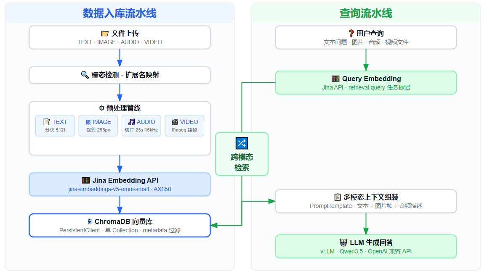

**数据入库流水线**：文件上传 → 模态检测 → 预处理（文本分块 / 图片裁剪 / 音频切片 / 视频控帧）→ 保存至 media_cache → Jina Embedding API (AX650N) → ChromaDB 向量库

**查询流水线**：用户查询（文本/图片/音频/视频）→ Query Embedding → 跨模态检索（相似度搜索）→ 多模态上下文组装 → LLM 生成回答 → 来源追溯

### 文件组织架构

```
Multimodal_RAG/
├── config/                          # 全局配置
│   ├── __init__.py
│   └── settings.py                  # Pydantic Settings, .env 加载, 所有可配置参数
│
├── src/
│   ├── embeddings/                  # 多模态嵌入层
│   │   └── jina_embedder.py         # JinaEmbedder: OpenAI 兼容 API
│   │                                
│   ├── preprocessing/               # 媒体预处理管线
│   │   ├── text_chunker.py          # 文本分块 
│   │   ├── image_processor.py       # 图片处理
│   │   ├── audio_processor.py       # 音频切片
│   │   └── video_processor.py       # 视频处理
│   │
│   ├── storage/                     # 向量存储层
│   │   ├── vector_store.py          # ChromaDB PersistentClient 封装
│   │   └── schemas.py               # MediaChunk / SearchResult / QueryResponse 数据模型
│   │
│   ├── retrieval/                   # 检索编排层
│   │   └── retriever.py             # MultiModalRetriever
│   │
│   ├── generation/                  # LLM 生成层
│   │   ├── llm_backend.py           # LLMBackend: OpenAI 兼容 Chat Completions API
│   │   └── prompt_templates.py      # PromptTemplate: 多模态上下文组装                             
│   │
│   ├── pipeline/                    # 端到端流水线
│   │   ├── ingestion.py             # IngestionPipeline: 文件 → 预处理 → 嵌入 → 存储
│   │   └── query.py                 # QueryPipeline: 问题 → 嵌入 → 检索 → 上下文 → LLM
│   │
│   └── api/                         # FastAPI REST 服务
│       ├── main.py                  # 应用入口, CORS, 静态文件, /api/media 服务
│       └── routes/
│           ├── ingestion.py         # /api/ingest/*  数据入库接口
│           ├── query.py             # /api/query/*   查询与检索接口
│           └── management.py        # /api/sources /api/stats /api/config 管理接口
│
├── static/                          # 前端
│   ├── index.html                   # 主页面: 4 Tab 布局
│   ├── app.js                       # API 客户端, 事件处理, 媒体预览
│   └── style.css                    # CSS 变量, 响应式布局
│
├── ui/                              # CLI 工具
│   └── cli.py                       # Typer CLI: ingest / query / status / clear
│
├── data/                            # 示例数据 (文本/图片/音频/视频)
├── media_cache/                     # 媒体文件缓存 (运行时生成)
├── chroma_db/                       # ChromaDB 持久化目录 (运行时生成)
│
├── .env.example                     # 环境变量模板
├── requirements.txt                 # Python 依赖
└── README.md
```

---

## 快速开始

### 1. 模型下载

请先根据以下链接下载基于 AX650N 芯片适配好的相关模型：

| 模型类型 | 模型名称（链接） | 说明 |
|---------|---------|------|
| **Multimodal LLM** | [Qwen3.5](https://huggingface.co/AXERA-TECH/Qwen3.5-2B-AX650-GPTQ-Int4-C256-P6K-CTX8K) | 多模态大语言模型 |
| **Omni Embedding** | [jina-embeddings-v5-omni-nano-retrieval](https://huggingface.co/AXERA-TECH/jina-embeddings-v5-omni-nano-retrieval) | 全模态嵌入模型 |

### 2. 环境准备

```bash
# 安装系统依赖 (视频/音频处理)
sudo apt install ffmpeg

# 安装 Python 依赖
pip install -r requirements.txt
```

### 3. 配置环境变量

```bash
cp .env.example .env
# 按需修改 .env 中的 API 地址、模型名称和预处理参数
```

关键配置项：

```env
# LLM 配置 (OpenAI 兼容)
LLM_API_KEY=sk-your_llm_api_key_here
LLM_API_BASE=http://127.0.0.1:8009/v1/
LLM_MODEL_NAME=AXERA-TECH/Qwen3.5-2B
LLM_MAX_TOKENS=4096
LLM_TEMPERATURE=0.3

# Embedding 配置 (OpenAI 兼容)
EMBEDDING_API_KEY=sk-your_embedding_api_key_here
EMBEDDING_API_BASE=http://127.0.0.1:8010/v1/
EMBEDDING_MODEL_NAME=AXERA-TECH/jina-embeddings-v5-omni-nano-retrieval-AX650-P128-CTX2047
EMBEDDING_DIMENSIONS=768
```

### 4. 启动模型服务

基于 AX650N 芯片启动 Embedding 服务：

```bash
# Embedding 服务 — 端口 8010
axllm serve /root/huangjie/AXERA-TECH/jina-embeddings-v5-omni-nano-retrieval --port 8010
```

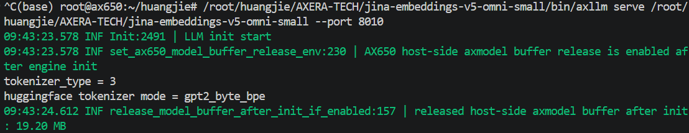

启动 LLM 服务：

```bash
# LLM 服务 — 端口 8009
axllm serve /root/huangjie/AXERA-TECH/Qwen3.5-2B-AX650 --port 8009
```

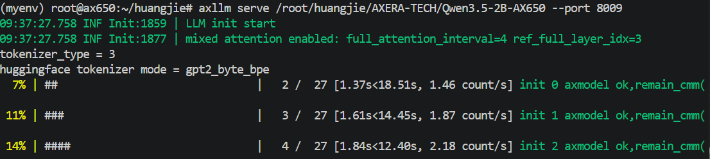

### 5. 启动项目

```bash
uvicorn src.api.main:app --host 0.0.0.0 --port 8000 --reload
```

浏览器打开 `http://localhost:8000` 进入 Web 界面。

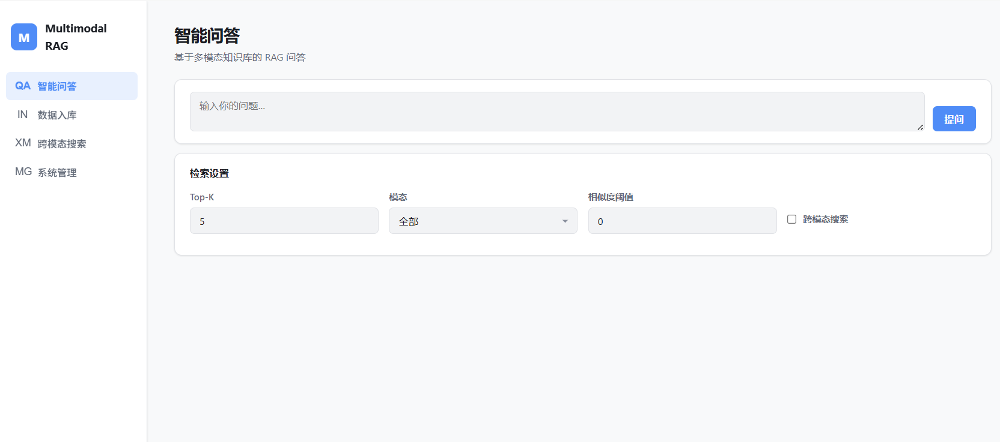

| Tab | 功能 | 说明 |
|-----|------|------|
| **智能问答** | RAG 问答 | 输入问题 → 选择模态过滤 / 跨模态模式 / 相似度阈值 → LLM 基于多模态上下文生成回答 |
| **数据入库** | 文件索引 | 拖拽上传文件 → 支持文本/图片/音频/视频 → 实时预览分块详情 → 管理已索引数据源 |
| **跨模态搜索** | 多模态检索 | 文本 / 图片 / 音频 / 视频作为查询 → 返回所有模态的检索结果 → 支持媒体预览播放 |
| **系统管理** | 配置管理 | 查看索引统计 → 浏览/删除数据源 → 修改模型与预处理配置（热更新） |

---

## 案例演示

### 1. 上传原始文件

支持 PDF、TXT、JPG、PNG、MP3、WAV、MP4 等格式，拖拽或点击上传。

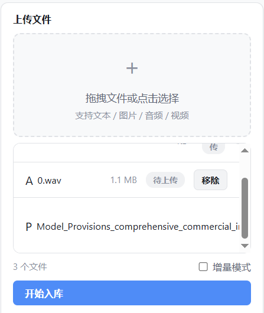

### 2. 构建索引

文件上传后自动检测模态，经预处理和 Embedding 后存入 ChromaDB。入库页面可实时查看分块详情与媒体预览。

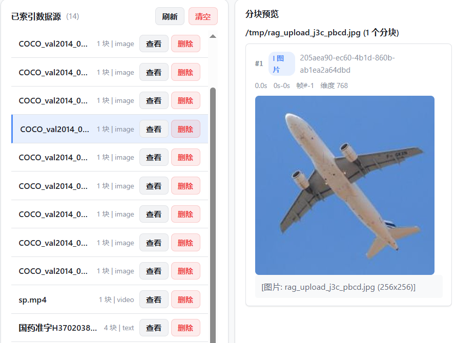

### 3. 跨模态检索

以文本、图片、音频或视频作为查询，一次检索返回所有四个模态的结果。支持媒体文件在线预览播放。

通过文本「**长颈鹿**」，检索出长颈鹿相关的文本、图片和视频片段。

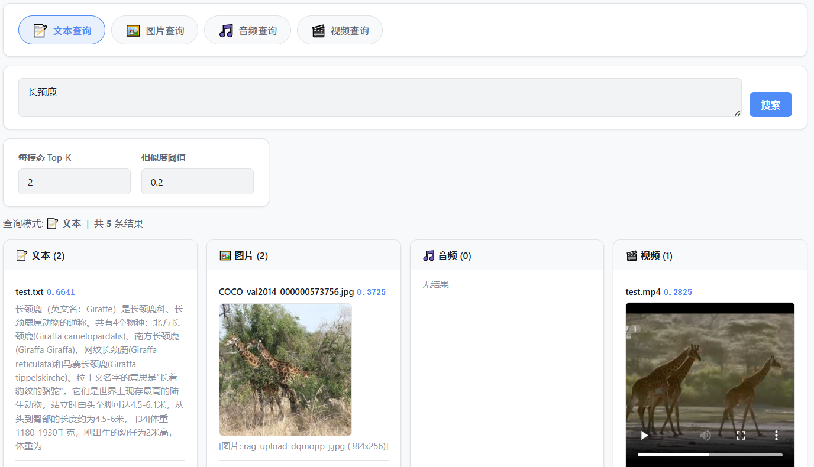

通过一张包含「**长颈鹿**」的图片查询，检索出长颈鹿相关的文本、图片和视频片段。

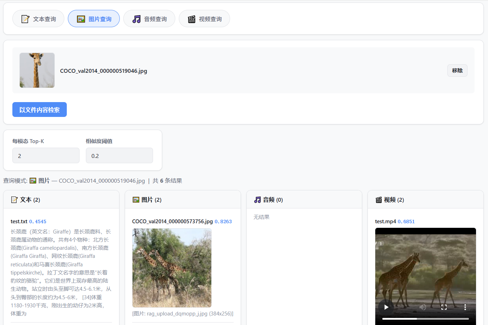

### 4. 智能问答

LLM 基于检索到的多模态上下文（文本段落 + 图片 + 视频关键帧）生成回答，每个回答附带来源引用。

提问「**图片中有几个面包**」，系统在知识库中正确检索到相关的图片，并解析图片内容进行正确回答：「**5个面包**」。


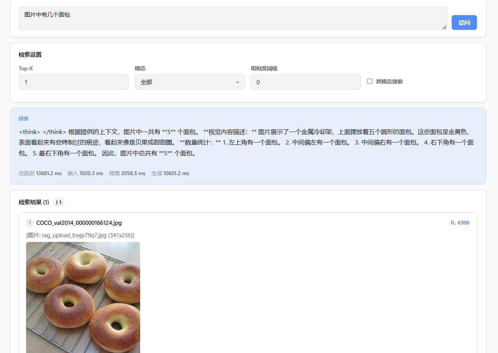

提问「**sp视频中主持人的衣服颜色**」，系统检索到包含主持人的相关视频片段，并解析视频内容进行回答：「**主持人的衣服颜色为蓝色**」。

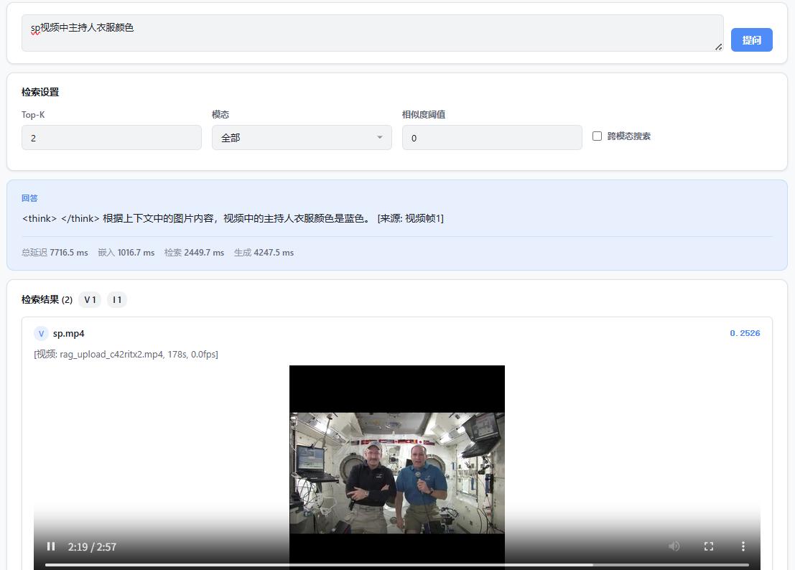

---

## 硬件资源占用

基于 AX650N 平台运行本项目时，内存（CMM）、Flash 占用情况如下：

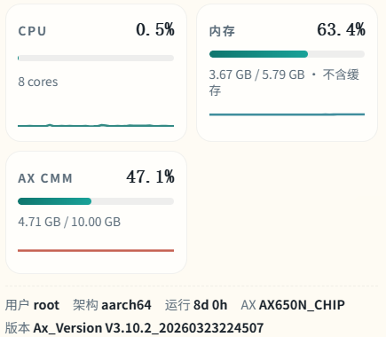

---

## 常见问题

### Q: 上传视频后检索不到？

确保 ffmpeg 已安装，且视频时长 > 0。预处理后的视频作为单向量嵌入，视频文件名即为检索标识。查看服务日志确认 `video_segment` 类型 chunk 是否创建成功。

### Q: 图片预览/视频播放显示不出来？

检查 `media_cache/` 目录权限，确保 `/api/media/{chunk_id}` 能正常访问。视频缓存为 `.mp4` 格式，浏览器需支持 H.264 编码。

### Q: Embedding API 返回 504 超时？

可能原因：图片/视频以本地文件路径发送但 API 服务器在远端无法访问。本项目已改为 base64 data URI 内嵌传输，若仍超时请检查 `IMAGE_TARGET_SIZE` 和 `VIDEO_MAX_FRAMES` 是否过大，或检查 AX650 服务端网络状态。


### Q: PDF 上传后提示「文本文件为空」？

可能为扫描版/图片型 PDF，不含可提取的文字层。服务端日志会显示页数和提取诊断信息。建议对扫描件使用 OCR 工具预处理后再上传，或安装 `poppler-utils` 获得更好的 PDF 文本提取效果。

### Q: 跨模态搜索中图片结果与文本查询不相关？

跨模态对齐效果取决于 Embedding 模型质量。本项目推荐使用 `jina-embeddings-v5-omni-nano-retrieval`（专为检索优化的版本）。如仍不满意，可尝试更换更大规模的 Embedding 模型。
